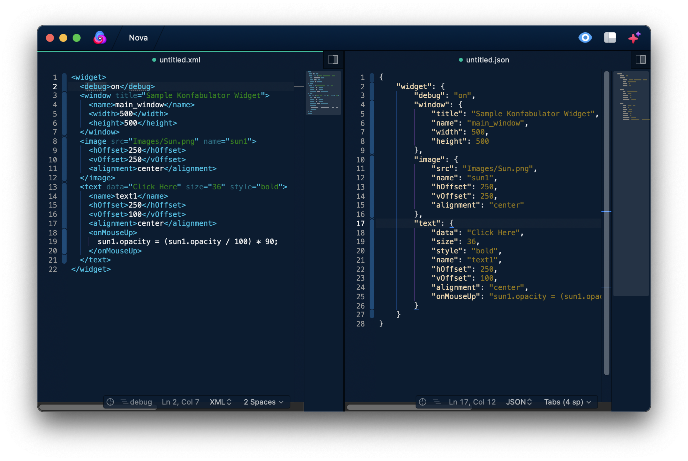

# Beautify for Nova

Beautify integrates [JS-Beautify](https://github.com/beautify-web/js-beautify) into Nova for formatting Javascript, JSON, CSS, SCSS, LESS, HTML and XML. Formatting is based on the current syntax mode and the indentation settings of the editor. 

